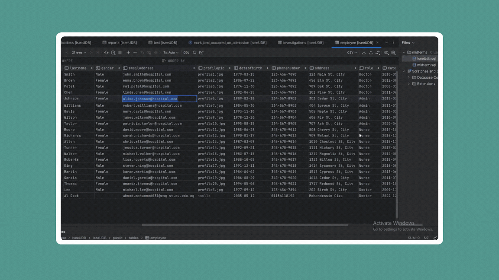
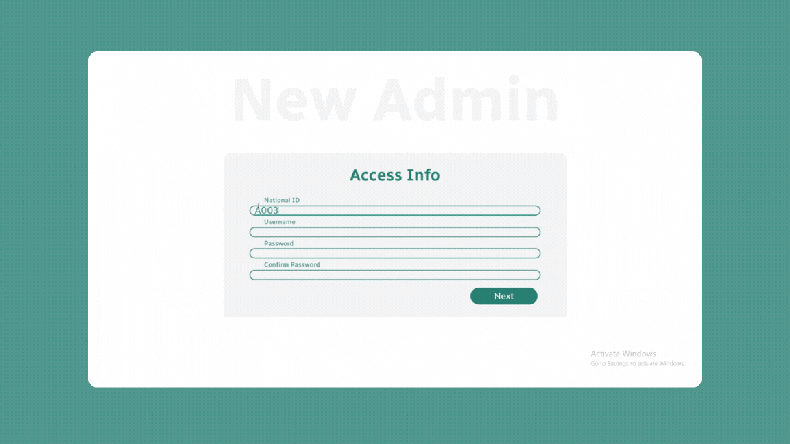

# ISEEU: ICU Management System


ISEEU is an intuitive hospital management system designed specifically for ICU operations. It streamlines patient care, staff coordination, and resource management by integrating real-time data tracking, secure access controls, and automated workflows. This tool is aimed at enhancing efficiency, reducing errors, and elevating patient outcomes in critical care units.

---

## Features

### 1. Real-Time ICU Operations
- **Bed Management:**
  - Monitor bed occupancy and availability in real time.
  - Optimize bed assignments for efficiency.
- **Patient Monitoring:**
  - Access patient records, vital signs, and treatment plans.
  - Update and track patient status effortlessly.

### 2. Role-Based Access and Interfaces
- **Administrator Dashboard:**
  - Manage staff records, generate reports, and oversee ICU operations.
- **Doctor and Nurse Views:**
  - Tailored tools for prescriptions, medication tracking, and care planning.
- **Patient and Emergency Contact Access:**
  - View limited personal and emergency details securely.

### 3. Real-Time Reporting and Visualization
- Generate reports for patient statistics, medication logs, and resource usage.
- Visualize data trends through interactive dashboards.

---

## Preview:
### ICU Department Trackning and mentoring
- **Admin Dashboard with all patients status and list of all doctors and nurses with - accepting new patient or discharging request:**
  
  
### Patient Monitoring and Bed Management
- **Doctor Checkup - adding medication or prescription - reports managment - discharging a patient:**
  

### Medication Tracking
- **Nurse dashboard, patient tracking, medications and scans schadule:**
  

### Adding new admins from certified one
- **Add New Admin**
  
---

### **Database Design**

The ISEEU ICU Management System leverages a **PostgreSQL** database to efficiently manage critical hospital operations. The database is designed to handle patient records, staff details, bed allocations, and medication tracking while ensuring data consistency and security.

#### **Key Tables**
- **Patients**: Stores patient demographics, admission status, and medical history.
- **Employee**: Maintains staff information, including doctors and nurses.
- **Encounters**: Tracks patient visits, including admission and discharge details.
- **Medications**: Records prescribed medications and administration logs.
- **Beds**: Manages ICU bed occupancy and availability.
- **Reports**: Stores medical reports generated during patient care.
- **Emergency Contacts**: Contains patient-specific emergency contact details.
- **Vital Signs**: Logs real-time monitoring data like heart rate and blood pressure.

#### **Relationships**
- **Patients ↔ Encounters**: Links patient data with their admission and discharge details.
- **Employee ↔ Encounters**: Tracks doctor and nurse involvement for each patient.
- **Beds ↔ Patients**: Reflects real-time bed occupancy status.

---

### **Database Schema Visualization**


---
## Getting Started

### Setup Instructions

#### Clone the Repository
```bash
git clone https://github.com/yourusername/ISEEU.git
```

#### Navigate to the Project Directory
```bash
cd ISEEU
```

#### Install Required Packages
```bash
pip install -r requirements.txt
```

```

### Front-End Setup

#### Navigate to the Front-End Directory
```bash
cd ReactISEEU
```

#### Install Front-End Dependencies
```bash
npm install
```

#### Start the Front-End
```bash
npm start
```

### Basic Usage

1. **Login/Register:**
   - Securely log in or register with role-specific access.
2. **Access ICU Tools:**
   - Admins, doctors, and nurses can utilize their customized dashboards.
3. **Monitor and Update:**
   - Track patient statuses, medication schedules, and more in real time.

---

## Dependencies

ISEEU relies on the following technologies and libraries:

| **Dependency**                     | **Version** | **Description**                                      |
|-----------------------------------|-------------|--------------------------------------------------|
| Flask                             | 2.2.5       | Back-end framework for creating RESTful APIs.     |
| psycopg2-binary                   | 2.9.6       | PostgreSQL database adapter for Python.           |
| NumPy                             | 1.24.3      | Numerical computations for data handling.         |
| Pandas                            | 1.5.3       | Data manipulation and analysis library.           |
| SciPy                             | 1.10.1      | Advanced scientific computing library.            |
| PyQt5                             | 5.15.9      | GUI framework for building desktop applications.  |
| PyQtGraph                         | 0.12.4      | Fast plotting and interactive 2D/3D visualization.|
| Matplotlib                        | 3.7.1       | Visualization library for charts and graphs.      |
| React                             | 18.2.0      | Front-end library for building user interfaces.   |
| Axios                             | 1.7.2       | HTTP client for fetching data.                    |
| @coreui/react                     | 5.1.0       | CoreUI components for React-based applications.   |
| @fortawesome/fontawesome-free     | 6.5.2       | Font Awesome icons for UI design.                 |
| @fortawesome/fontawesome-svg-core | 6.5.2       | Core package for Font Awesome SVG icons.          |
| @fortawesome/free-solid-svg-icons | 6.5.2       | Solid icons from Font Awesome.                    |
| @fortawesome/react-fontawesome    | 0.2.0       | React component library for Font Awesome.         |
| @testing-library/jest-dom         | 5.17.0      | Custom Jest matchers for testing DOM elements.    |
| @testing-library/react            | 13.4.0      | React testing utilities.                          |
| @testing-library/user-event       | 13.5.0      | Simulates user events for testing.                |
| Bootstrap                         | 5.3.3       | Front-end toolkit for responsive web design.      |
| Chart.js                          | 4.4.3       | JavaScript library for creating charts.           |
| FilePond                          | 4.31.1      | File upload library.                              |
| filepond-plugin-image-exif-orientation | 1.0.11   | Plugin for handling image EXIF orientation.       |
| filepond-plugin-image-preview     | 4.6.12      | Plugin for image preview functionality.           |
| React-Bootstrap                   | 2.10.2      | Bootstrap components for React.                   |
| react-chartjs-2                   | 5.2.0       | React wrapper for Chart.js.                       |
| react-filepond                    | 7.1.2       | React wrapper for FilePond.                       |
| react-hook-form                   | 7.51.5      | Library for handling forms in React.              |
| react-icons                       | 5.2.1       | Library for using popular icon sets in React.     |
| react-query                       | 3.39.3      | Data-fetching library for React.                  |
| react-router-dom                  | 6.23.0      | Routing library for React applications.           |
| react-scripts                     | 5.0.1       | Scripts and configuration for Create React App.   |
| web-vitals                        | 2.1.4       | Library for measuring web performance metrics.    |


---

## Contributors <a name="Contributors"></a>
<table>
    <td align="center">
      <a href="https://github.com/AhmedXAlDeeb" target="_blank">
        
        <br />
        <sub><b>Ahmed AlDeeb</b></sub>
      </a>
    </td>
    <td align="center">
      <a href="https://github.com/MohamedHisham20" target="_blank">
        
        <br />
        <sub><b>Mohamed Hisham</b></sub>
      </a>
    </td>
      <td align="center">
      <a href="https://github.com/TalalEmara" target="_blank">
        
        <br />
        <sub><b>Talal Emara</b></sub>
      </a>
    </td>
      <td align="center">
      <a href="https://github.com/Shahd-A-Mahmoud" target="_blank">
        
        <br />
        <sub><b>Shahd-A-Mahmoud</b></sub>
      </a>
    </td>
     <td align="center">
      <a href="https://github.com/enjyashraf18" target="_blank">
        
        <br />
        <sub><b>enjy ashraf</b></sub>
      </a>
    </td>
</tr>
</table>

Thank you for using ISEEU! Feel free to contribute or provide feedback to help us improve.
